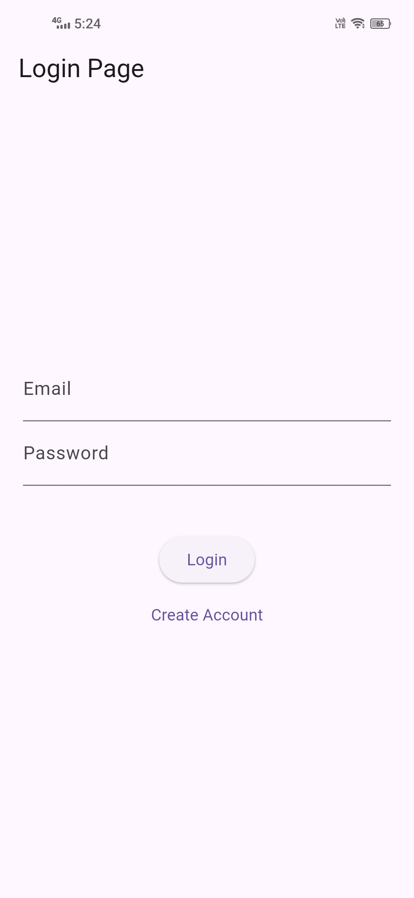
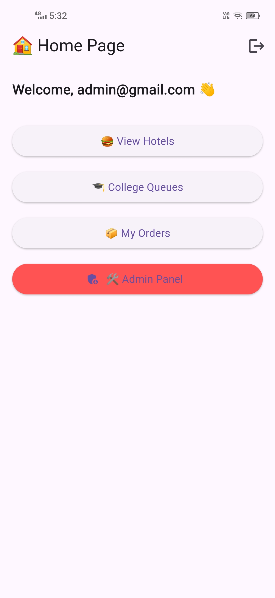

# 🚀 digital-queue-system

This Flutter project is a streamlined Digital Queue Management System designed to simplify ordering and service flow. It allows users to join queues, track live queue status, browse menus, place orders, and manage carts—all through an intuitive interface. The admin panel enables real-time control and monitoring, ensuring fast, organized, and efficient service.

# ✨ Features

🔐 User Login / Signup

🏠 User Dashboard

🛠️ Admin Panel

📦 Easy to Install


# 📸 Screenshots

### 🔐 Login Page


### 🏠 User Home


### 🛠️ Admin Dashboard


# ⚙️ Installation

# Clone the repo
```
git clone https://github.com/sachindra535/digital-queue-system.git
```
# Go inside the project folder
```
cd digital-queue-system
```
# Install Flutter dependencies
```
flutter pub get
```
# Run the Project
```
flutter run
```
# To use your own Firebase, replace:

Android:
```
android/app/google-services.json
```
iOS:
```
ios/Runner/GoogleService-Info.plist
```

That’s it — no extra setup needed.
# 🔥 How to Create Your Own Firebase Config (google-services.json)

If someone wants to use their own Firebase project, they must generate:

✔ android/app/google-services.json
✔ ios/Runner/GoogleService-Info.plist

Follow these steps:
Step 1 — Create a Firebase project

Go to:
```
https://console.firebase.google.com/
```
Click:
➡ Add project
➡ Enter a project name
➡ Continue setup

Step 2 — Enable Firebase Authentication

Inside your Firebase project:

Build → Authentication → Get started
Enable Email/Password sign-in.


# 🔐 Admin Access
The admin account is not pre-created.
When you connect the project to your own Firebase, you can simply create the admin account from inside the app itself using the normal signup/login flow.

✔ How it works:

The app checks if the logged-in user’s email is admin@gmail.com

If yes → the user is redirected to the Admin Panel

If not → they are taken to the User Dashboard

✔ What you need to do:

1 After configuring your Firebase:

2 open the app

3 Create a new account using this email:

4 admin@gmail.com


Set any password you want

Log in → You now have full admin access

⚠ This email does NOT need to be real — it only exists inside Firebase.

# 📁 Project Structure (Clean & Simple)
```
lib/
|-- screens/
|   |-- admin_panel/
|   |   `-- admin_panel.dart
|   |-- cart_page/
|   |   `-- cart_page.dart
|   |-- colleges_page/
|   |   `-- colleges_page.dart
|   |-- home_page/
|   |   `-- home_page.dart
|   |-- hotels_page/
|   |   `-- hotels_page.dart
|   |-- live_queue_page/
|   |   `-- live_queue_page.dart
|   |-- login_page/
|   |   `-- login_page.dart
|   |-- menu_page/
|   |   `-- menu_page.dart
|   `-- orders_page/
|       `-- orders_page.dart
|
`-- main.dart
```

 # 🧪 Tech Stack

Flutter 3.x

Dart

Provider / Riverpod (optional state management)

Material UI Components

Local / Cloud API Ready

# 🤝 Contributing

Contributions, issues, and feature requests are welcome!

Just open a PR — let's build something awesome 🔥

